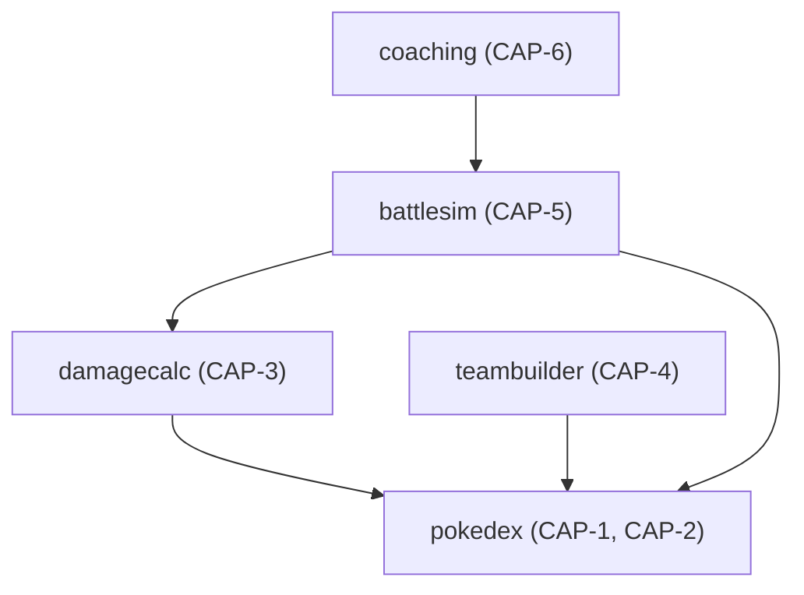

# AD-2: Module dependency direction is fixed

**Date**: 2026-08-19
**Status**: accepted

## Context

Capabilities built independently (even by the same person, across sessions) risk circular imports and duplicated logic — e.g. two independent implementations of damage resolution, one in `damagecalc` and a second one, semantically drifted, inside `battlesim`.

## Decision

Dependencies flow one direction only:

`pokedex` is the base layer with no dependency on any other capability package. `teambuilder` depends on `pokedex` plus ETL-ingested tournament data — never on `damagecalc` or `battlesim`. `coaching` depends on `battlesim`'s persisted event log as a read model, never the reverse.

Shared input types that both `damagecalc` and `battlesim` need — the type-effectiveness chart and field conditions (weather, terrain, screens) — are owned and exported by `damagecalc`; `battlesim` imports them directly rather than defining its own copy.

## Consequences

### Positive
- No circular imports are possible by construction — the Go compiler enforces this, not a lint rule.
- One `FieldConditions` type exists, not two that can silently drift (e.g. a future Trick Room addition landing in only one module's struct).

### Negative
- A capability that turns out to need something "backwards" (e.g. `pokedex` needing team-builder data) is a signal the dependency direction itself is wrong for that case, not something to route around locally.
